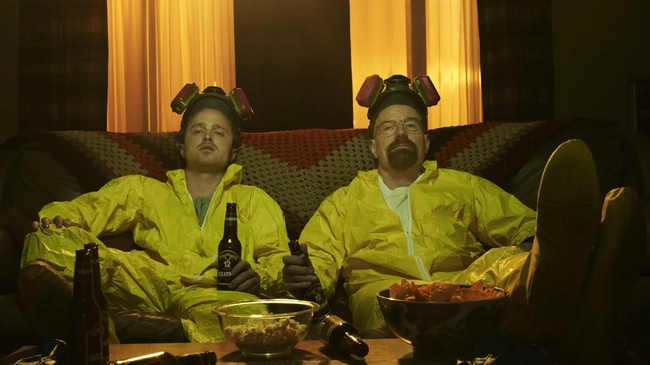
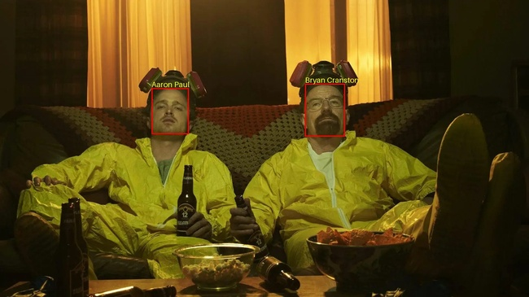

# Automated Celebrity Recognition & Image Annotator

An automated serverless pipeline built on AWS using Python and `boto3`. When an image containing famous personalities is uploaded to an Amazon S3 bucket, an S3 Event Notification triggers an AWS Lambda function. The function calls Amazon Rekognition to detect celebrities, draws bounding boxes and name overlays around identified faces using Pillow (PIL), and saves the annotated image back to the bucket under the `output/` prefix.

---

# Visual Comparison

 

# Architecture & How It Works
```text
[ S3: input/ ] ──> (S3 Event) ──> [ AWS Lambda ]
                                     │     │
                 ┌───────────────────┘     └──────────────────┐
                 ▼                                            ▼
       [ Amazon Rekognition ]                       [ S3: output/ ]
     (Detects Celebrity Faces)                   (Stores Output Image)
```
1. Upload Trigger: An image is uploaded to the S3 bucket under the input/ folder prefix.
2. Lambda Execution: S3 triggers lambda_function.py.
3. Face Recognition: AWS Lambda sends the raw image to Amazon Rekognition via recognize_celebrities().
4. Image Processing: Python’s Pillow library plots red bounding boxes around detected face coordinates and renders yellow labels with celebrity names above each face.
5. Output Generation: The processed JPEG is written directly to the output/ folder in S3 (output/processed-<filename>).

# Project Structure
```Plaintext
.
├── assume-role-lambda.json   # IAM Trust Policy for AWS Lambda
├── policy-rek-s3.json        # IAM Permissions Policy for S3, Rekognition & CloudWatch
├── notif.json                # S3 Event Notification configuration
├── lambda_function.py        # Core AWS Lambda handler & image processing logic
├── requirements.txt          # Python dependencies (boto3, pillow, python-dotenv)
└── images/
    ├── breaking-bad.jpg           # Sample input image
    └── processed-breaking-bad.jpg # Output sample with bounding boxes & tags
```
# Prerequisites📋
- AWS Account with access to S3, Lambda, Rekognition, and IAM.
- AWS CLI configured locally with appropriate credentials.
- Python 3.9+ for local development or layer packaging.

## Deployment & Setup Guide
#### 1. Create S3 Bucket
Create an S3 bucket (e.g., my-rekognition-celebrity-bucket):

```Bash
aws s3 mb s3://my-rekognition-celebrity-bucket
```

#### 2. Configure IAM Role & Policies
Create the IAM Role for Lambda using the trust policy:
```Bash
aws iam create-role \
  --role-name LambdaRekognitionS3Role \
  --assume-role-policy-document file://assume-role-lambda.json
```

Create and Attach Policy: Update policy-rek-s3.json by replacing YOUR_BUCKET_ARN with your actual bucket ARN (e.g., arn:aws:s3:::my-rekognition-celebrity-bucket), then attach it:
```Bash
aws iam put-role-policy \
  --role-name LambdaRekognitionS3Role \
  --policy-name RekognitionS3Permissions \
  --policy-document file://policy-rek-s3.json
```

#### 3. Deploy the AWS Lambda Function

Package Dependencies:
Package lambda_function.py and its dependencies (notably Pillow and boto3) into a deployment .zip file or use AWS Lambda Layers for Pillow.
```Bash
pip install --target ./package -r requirements.txt
cd package && zip -r ../deployment.zip . && cd ..
zip -g deployment.zip lambda_function.py
```

Create the Lambda Function:
```Bash
aws lambda create-function \
  --function-name RecognizeCelebritiesFunction \
  --runtime python3.11 \
  --role arn:aws:iam::<YOUR_ACCOUNT_ID>:role/LambdaRekognitionS3Role \
  --handler lambda_function.lambda_handler \
  --zip-file fileb://deployment.zip \
  --timeout 30 \
  --memory-size 512
```

#### 4. Configure S3 Event Notification

Grant S3 Permission to Invoke Lambda:
```Bash
aws lambda add-permission \
  --function-name RecognizeCelebritiesFunction \
  --statement-id s3-trigger-permission \
  --action lambda:InvokeFunction \
  --principal s3.amazonaws.com \
  --source-arn arn:aws:s3:::my-rekognition-celebrity-bucket
```

Apply S3 Notification:
Update notif.json with your Lambda Function ARN, then apply it:

```Bash
aws s3api put-bucket-notification-configuration \
  --bucket my-rekognition-celebrity-bucket \
  --notification-configuration file://notif.json
```

# Testing the Pipeline

Upload an image containing celebrities to the input/ folder in your S3 bucket:
```Bash
aws s3 cp images/breaking-bad.jpg s3://my-rekognition-celebrity-bucket/input/breaking-bad.jpg
```

Verify Logs: Check AWS CloudWatch Logs for /aws/lambda/RecognizeCelebritiesFunction to view detection output (e.g., Bryan Cranston - 99.80%).

Download Processed Output:
```Bash
aws s3 cp s3://my-rekognition-celebrity-bucket/output/processed-breaking-bad.jpg ./processed-result.jpg
```

# Prevention of Infinite Recursion
While execution I faced a problem with infinite loop where saving a new image triggers the Lambda again:

The S3 Event Notification in notif.json strictly listens for uploads with the input/ prefix filter.
The Python script explicitly skips execution if the key starts with output/:
```Python
if file_name.startswith("output/"):
    return
```
